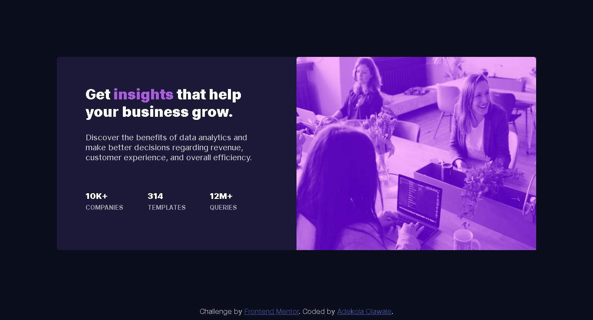

# Frontend Mentor - Stats preview card component solution

This is a solution to the [Stats preview card component challenge on Frontend Mentor](https://www.frontendmentor.io/challenges/stats-preview-card-component-8JqbgoU62). Frontend Mentor challenges help you improve your coding skills by building realistic projects. 

## Table of contents

- [Overview](#overview)
  - [The challenge](#the-challenge)
  - [Screenshot](#screenshot)
  - [Links](#links)
- [My process](#my-process)
  - [Built with](#built-with)
  - [What I learned](#what-i-learned)
  - [Continued development](#continued-development)
  - [Useful resources](#useful-resources)
- [Author](#author)

## Overview

### The challenge

Users should be able to:

- View the optimal layout depending on their device's screen size

### Screenshot


#### Mobile View


#### Desktop View

### Links

- Solution URL: [Add solution URL here](https://your-solution-url.com)
- Live Site URL: [Add live site URL here](https://your-live-site-url.com)

## My process

### Built with

- Semantic HTML5 markup
- CSS custom properties
- CSS Grid
- Mobile-first workflow
- Media Queries

### What I learned

I learnt the way of displaying images responsively, using the ```srcset``` attribute to display different sizes of images that can appear sharp based on device-pixel-ratio and also using media queries to display the length of an image based on the width of the device screen.
```mix-blend-mode``` css property also was new thing to me, I learnt about it when I was trying to get the right color texture for the background image overlay that can match the challenge design precisely.

It basically sets how an element's content should blend with the content of the element's parent and the element's background based on the keyword value that was set.

It can be used as displayed below:


```css
.stats-card-img:after {
  mix-blend-mode: hard-light;
}
```
The properties has many keyword values like ```color```, ```color-burn```, ```color-dodge```, ```difference```, ```hue```, ```soft-light``` etc.

I also learnt the right way to add a color overlay to an image.

```css
.stats-card-img:after {
  content: "";
  display: block;
  width: 100%;
  height: 100%;
  background-image: linear-gradient(
    to right,
    hsl(277, 64%, 61%),
    hsl(277, 64%, 61%)
  );
  position: absolute;
  top: 0;
  left: 0;
}

.stats-card-img {
  position: relative;
}
```

### Continued development

I like to learn more on displaying images responsively using ```srcset``` attribute, also how the ```picture``` ties into this, also the use of media queries to display images according to the screen width.

### Useful resources

- [Responsive Images Done Right](https://www.smashingmagazine.com/2014/05/responsive-images-done-right-guide-picture-srcset/) - This helped me for the displaying responsive image bit of the challenge.
- [Create simple CSS image overlay](https://www.youtube.com/watch?v=SXQ9l0ScDEA&t=206s) - This video helped me understand how to add an overlay to an image, very simple explanation and easy to understand.

## Author

- Website - [Adekola Olawale](https://studiogenix.netlify.app)
- Frontend Mentor - [@Kola92](https://www.frontendmentor.io/profile/Kola92)
- Twitter - [@yourusername](https://www.twitter.com/olawale_adekola)

